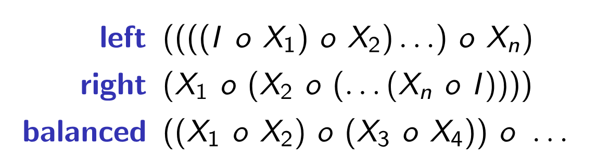

Author: Xiao Liang Yu

This document may contain some subjective opinions(might be mine or Peter's personal opinions)

Declarative Programming 2016S2
=====

Why Declarative Language
=====

- Programs are normally shorter
- Thread-safe for sure (good for parallel programming)
- Can **allow us to write program using imperative language better!!!**


Side effects
=====

A side effect might

- modify a global or a static variable
- modify one of its arguments
- raise an exception
- write data to a display, file or network
- read data from a keyboard, mouse, file or network
- call other side-effecting functions

With side-effects, a program's behavior *depends on history*.
When you have a program with side-effects, you *have to look through everything to understand the program*

Declarative languages has only *one side-effect*. That is *raising an exception*.

### Declarative Language good for large systems

For example, one of your function's calls changed the input argument and you don't know and used it somewhere else and produced unexpected result, it's very hard to fix the bug since you don't know that unless you understand all the functions you function calls.


Referential Transparency
=====

The absence of side effects *allows an expression can be replaced with its value*
This requires that the expression has **no side effects** and is **pure**(i.e. **always returns the same results on the same input**)

In contrast, in imperative languages(like C, Lisp), functions in general are not pure and are thus not functions in a *mathematical sense*. Two identical calls may return different results. 


Comparison between imperative and functional
=====

Imperative

- based on *commands*, in the form of *instructions* and *statements*
- Commands
    + are executed
    + have an effect


Functional

- based on *expressions*
- Expressions
    + are evaluated
    + have no effect
- Calling a function with same arguments will always get the same result


Terminology
=====

- Command
    + are executed
    + have an effect
- Expression
    + are evaluated
    + have no effect
- Pure
    + code that doesn't modify data
- AntiPattern
    + An AntiPattern is a literary form that describes a commonly occurring solution to a problem that generates decidedly negative consequences.
- Reduction
    + reduce the dimension of a value
    + e.g. reduce a list to a single value
- IO function
    + function that returns IO descriptions
- Predicate
    + a relation
- Interpretation
    + mapping from the symbols in the program to the world of the program

Prolog
=====

- based on the predicate calculus and the concept of the relation - the relationship among a number of individuals and the predicate that relates them
- functions are special kind of relations that can only be used **in one direction** (inputs to outputs) and can only have one result while relations don't have these limitations
- Relations
    + specify a relationship
- Debugger
    + `skip` to the exit/fail port of current goal
    + `retry` restarts a goal from the beginning (back to the time when starting to execute that goal)
    + `creep` step by step debugging
    + Spypoints
        * like a breakpoint
    + `leap`
        * run until reaches a spypoint
    + `+` add spypoint to current point
    + `-` remove spypoint from current point
- Determinism
    + means the ability to return all solutions
    + being deterministic is an important thing in Prolog
    + leaving choicepoints might make some predicate indeterministic
- Special things
    + `X = 1 + 2` will only make `X` become the term `1 + 2` instead of `3` - use `is` to evaluate arithmetic expressions
- Byrd box model
    + two input ports: *call* and *redo*
    + two output ports: *exit* and *fail*
- Prolog will execute statements in the order you specify them (different in Haskell)
- modes
    + unbound - output
    + bound - input
- a subset of Prolog
- declarative programming language
- dynamically typed
- Closed world assumption.
    + assume that things that can be proven to be `true` had been defined
    + therefore we have to be careful about the negation
    + create the reverse implication for all true statements is called Clark completion of the program
- Syntax
    + `.` means the end of statement
- comment
    + `%` for inline comments
    + `/*  COMMENT  */` for both inline/multi-line comments
- doesn't have list comprehension
- Prolog files
    + `.pl` Prolog files should start with a **lower-case letter** and *contains only* **letters, digits, and underscores**
    + we can include using `[FILENAME_WITHOUT_EXTENSION].`
- if-then-else
    + using `->`
    + when success, anything before `->` and after `;` will be forgotten
        * means it is used to define exclusive situations
    + good thing is, it will not leave a choicepoint
        * can make predicates deterministic
        * due to this, sometimes this will make predicate unable to work in some modes 
- Goal
    + Query
        * a query may use multiple predicate applications
    + `make.`
        * reload the loaded scripts
- Tail recursion
    + the recursive call is made at the of every execution
    + both Prolog and Haskell optimize for this situation
    + this can be transformed into loops
        * reason of this is doable is because it is known that the intermediate frames are not needed and can be compassed
    + **if the predicate itself leaves a choicepoint each call, the tail recursion optimization can't be performed since they have to keep the the information needed for backtracking**
    + One easy method to make it this way is adding an accumulator
        * extra parameter to the predicate that holds a partially computed result
        * normally, the base case is when the partially computed result is the actual final result
- Operator
    + `=` for equality and unification
        * it can be used to bind variables and check for equality
    + `is` evaluates expressions and assign values
        * second argument must be ground
    + Inner join(And/Conjunction)
        * use `,` to separate them
        * higher precedence than Disjunction
    + (Or/Disjunction)
        * use `;`
    + `\+` negation
        * higher precedence than conjunction and disjunction
    + `\=` disequality
- Predicate
    + facts
        * base clauses
    + rules
        * `Head :- Body`
            - `Head` has the form of a fact
            - `Body` has the form of a query
        * Can be recursive
        * predicate that has "if"
    + two clauses belong to the same predicate if they have the same functor(name) and arity(number of arguments)
    + two possible views
        * a function from all possible combinations of n terms to a truth value
        * a set of tuples of n terms, every tuple in this set is implicitly mapped to `true` while every tuple not in this set is implicitly mapped to `false`
- Datalog
    + subset of Prolog
    + has only **atomic terms** and **variables** (**no compound**)
- Prolog Terms
    + Negation as failure ??TODO
    + atomic
        * integers, floating point numbers and atoms
            - *atoms* **begin with lower case letter** and follows with letters, digits and underscore
                + normally use `_` instead of Camel case
            - can be(not must be) surrounded by single quotes(`'`)
                + normally won't use unless we have to express the name exactly
                + **`'abc' = abc`**
                + **`"abc" \= abc`**
            - usual character escapes can be used
        * `canton`, `china`
    + ground
        * term without free variables in it
    + compound
        * have a *functor*(function symbol) followed by *zero or more arguments
            - functors are *data constructors*
            - e.g. `node(leaf, data, node(leaf, data2, leaf))`
    + Variable
        * begins with a **capital letter** or **underscore** and follows with **letters, digits, and underscores**
        * query containing a variable asks if there exists a value for that variable that makes that query true and prints the corresponding values
            - it will print out the solution one-by-one
            - you have to input `;` to make it print; or,
            - hit "Enter" if you don't want to know more possible solutions 
        * `_` underscore means you don't care the value, and it will match anything
    + Ground term
        * a term is a ground term *if it contains no variables*
        * `3`, `f(a,b)`
        * has only one instance
    + Nonground term
        * a term contains at least one variable
        * `f(a,X)`
        * potentially has an infinite number of instances
- Substitution
    + mapping *from variables to terms*
    + the term that results from applying a substitution $ \theta $ to a term $ t $ is denoted $ t\theta $
    + term $ u $ is an instance of term $ t $ if there is some substitution $ \theta $ such that $ u = t\theta $ 
    + a substitution unifies $ t \text{and} u $ if $ t\theta = u\theta $
    + applying a substitution $ {X->a} $ to $ f(X, b) \text{and} f(a,Y) $ yields $ f(a,b) \text{and} f(a,Y) $ which are not syntactically identical -> this substitution is not a unifier while $ {X -> a, Y -> b} $ is a unifier
- Instantiation pattern
    + `+`
        * Argument is fully instantiated at call-time, to a term that satisfies the type. This is not necessarily ground, e.g., the term `[_]` is a list, although its only member is unbound.
    + `-`
        * Argument is an **output argument**. It may be unbound at call-time, or it may be bound to a term. In the latter case, the predicate behaves as if the argument was unbound, and then unified with that term after the goal succeeds. For example, the goal findall(X, Goal, [T]) is good style and equivalent to findall(X, Goal, Xs), Xs = [T]3 Determinism declarations assume that the argument is a free variable at call-time. For the case where the argument is bound or involved in constraints, det effectively becomes semidet, and multi effectively becomes nondet.
    + `?`
        * Argument is bound to a partial term of the indicated type at call-time. Note that a variable is a partial term for any type.
- List
    + empty list `[]`
    + `[1,2,3]`
    + elements can be of different types
    + list construction
        * `[X|Xs]`
        * there should be only one term after `|`
        * however, there can be more than one term before `|`
            - `[X1, X2 | Xs]`
        * A proper list must end with an empty list `[]`
- Arithmetic Operators (for numbers)
    + `+`, `-`, `*`
    + `/` division
    + `//` integer division - rounds towards zero
    + `div` integer division - always rounds down
    + `mod` modulo - result has same sign as **second argument**
    + `rem` remainder - result has same sign as **first argument**
    + `-` unary minus
    + `<`, ***`=<`***
    + `>`, `>=`
    + `=:=` equal, `=\=` not equal
- Prolog special order comparing
    + `@<`, `@=<`, `@>`, `@>=`
    + Variables < Numbers < Atoms < CompundTerms
    + comparing between atoms
        * alphabetical ordering
    + comparing between functors
        * first, arity
        * second, alphabetically by functor
        * lexicographical order
- IO
    + not pure
    + all operations can't be undone on backtracking
    + not logical since `write("hello "), write("world!").` is not equal to `write("world!"),write("hello ").` (while conjunction is supposed to be commutative)
- defining operators
    + `op(Precedence, Type, Name)`
- Built-in predicate
    + `integer/1`, `float/1` can be used to both detect the type of the term and convert to the specific type
    + `atom/1`, `compound/1` true if the argument is of the specific type and fails for variables
    + `var/1` holds for unbound variable
    + `nonvar/1` holds for any term other than an unbound variable
        * it holds even when the term is a non-ground compound term
    + `ground/1` holds for ground term
        * this requires traversing the whole term
    + `functor(?Term, ?FunctorName, ?Arity)`
        * `functor(a-b, -, 2).` is `ture.`
        * interestingly, `functor(42, 42, 0).` holds
    + `arg(?ArgNumber, +Term, ?Value)`
        * the `Term` must be compound
        * the `ArgNumber` is 1-based
        * e.g. `arg(1, 42-2, 42).` holds
    + `reverse/2`
    + `setof/3` -> `setof(Template, Predicate, OutputList)`
        * put all the solutions to the `OutputList`
        * if some variable is not in the template, `setof/3` will backtrack over distinct binding of these variables
        * return you a `set`(sorted and duplicates removed) in list format
    + `bagof/3`
        * similar to `setof/3` just that this **doesn't sort the result or remove duplicates**
    + `^/2` (When used with `setof/3` or `bagof/3`)
        * collects solutions for a template regardless of the bindings of some of the variables not in the Template
    + `^/2` (When used with expressions)
        * same as `**/2` for calculating exponents
        * can be used with floating point numbers
    + `call/n`
        * this can do currying
        * this goal will be true when the underlying called predicate is true
        * e.g. `X = length([1,1,1]), call(X, 3).` is `ture.` while `X = length([1,1,1]), call(X, 2).` is `false.`
    + `read/1`
        * read in Prolog term
        * similar to `read` in Haskell
        * impure
    + `write/1`
        * write Prolog term to screen
        * impure
    + `get0/1`
        * get a character from user
    + `put/1`
        * output a character to user
    + `nl/0`
        * emits a newline input from the user
    + `sort/2`
        * sorts a list according to `@<` ordering , *removing all duplicates*
    + `msort/2`
        * sorts a list according to `@<` ordering, **without removing duplicates**
    + `keysort/2`
        * stably sorts list of `X-Y` terms, only comparing `X` parts
        * ascending
    + `include/3`
        * filter elements that returns true when they are applied to the condition
    + `select/4`
    + `selectchk/4`
    + `member/2`
    + `memberchk/2`
        * semi deterministic version of `member/2`
        * this will return true without leaving any choicepoint when the element is found
    + `range/3`
    + `spy(Predicate)`
        * the predicate can be a *Name/Arity pair* or just the *Name*
    + `nospy(predicate)`
    + `maplist(Goal, List)`
        * holds when all elements in `List` holds when apply to the `Goal`
    + `plus/3` -> `plus(X, Y , Result)`
        * `Result == X + Y`

Haskell
=====
- equational reasoning
    + if two expressions have equal values, then one can be replaced by the other
- Function
    + consists of equations, each of which establishes an equality between the left and right hand sides of the equal sign
    + set of patterns should be exhaustive
        * **at least one pattern should apply for any possible call**
    + the set of patterns should also be exclusive
        * at **most one pattern should apply** for any possible call
    + matching lists
        * `[]` matches *empty* list
        * `[x]` matches list of *length 1*
        * `(_:_)` matches list of length *at least 1*
        * `(_:_:_)` matches list of length *at least 2*
        * e.g.
```Haskell
f (_:_:_) = 1 -- for length at least 2
f (_:_) = 2 -- for length at least 1
f [] = 3 -- for length == 0
```
    + calling a function: `f fa1 fa2 fa3`
    + recursion is the key
    + `function_name :: TYPE1 -> TYPE2...`
        * declare function `function_name` 
    + Partial applications of functions
        * we can define a function with a call to the other function sharing some of the arguments while some of the arguments of that call are fixed
        * It's with the creation of *closure* when it's a function
            - e.g. `(some_function first_argument)`
        * When it's an infix operator, we can make it a partially applied function with surrounding buckets. This involves creating a *section* 
            - e.g. `(/3)`, `(3/)`
    + infix operators can be used as if it's a function by having brackets surrounding it
        * e.g. `(*) 8 9 == 72`
    + any arity-2 function can be turned into an infix operator by surrounding with backquotes(`)
        * e.g. ``3 `mod` 2 == 1``
    + Pattern Matching Misc
        * `lst@(x:xs)`
    + currying
        *  `->` denotes a function that takes an argument of the type on the left, and returns a value of the type on the right
        *  in Haskell, all functions take only one argument and return one value
- Naming
    + must start with a lower case letter
    + consists of letters, numbers and/or underscores
- Indentation matters
    + Suppose line1 starts in column `n` and the following nonblank line, line2, starts in column `m`. The *offside rule* says
        * if `m > n`, line2 is a continuation of the construct on line1
        * if `m = n`, line2 is the start of a new construct at the same level as line1
        * if `m < n`, line2 is either the continuation of something else that line1 is part of, or a new item at the same level as something else that line1 is part of
- Order of Evaluation
    + it matters when it comes to efficiency
- lexicographic ordering
    + It compares the values in turn, from left to right. Means the value that comes the first will have the most significance.
- Single assignment
    + You can only define a variable's value ***once***
        * You can't change it later (all `const` variables)
    + `let a=12302130213232 in .....`
        * only define `a` in the expression after `in`
        * can be used anywhere where expressions are allowed
    + `...... where a=434234343244`
        * has to attach to a definition
- *strong*, *safe* and *static* type system
    + *strong*
        * you can't cast
    + *safe*
        * it won't crash because of a type error
    + *static*
        * types are checked when the program is compiled, not when the program is run
    + Although it's rare, Haskell can have a dynamic type
- Special things
    + `_` is a placeholder for things that you want to ignore
- Variables
    + must start with a lowercase letter
    + `it` the result returned by the last successfully evaluated expression (only for ghci)
    + prohibited names
        * `_`, `it`, all operators 
- Ordering
    + We can use whatever defined after
```Haskell
y = x + 1
x = 123

-- It's valid and y == 124
```
   + For pattern matching, it will always try to match the ones that define before
- Typeclass
    + a collection of types that there are some functions are defined for them
    + e.g. typeclass `Num`
        * `(+), (*), abs, signum, fromInteger, (negate | (-))` must be defined in order to be in typeclass `Num`
- Types
    + Must start with Upper-case letter
    + `String`
        * `type String = [Char]`
        * multi-line string literal can be defined by adding `\` at the end of the line and adding another `\` to the beginning of the line below
            - When we write the line in this way, the newline character won't be included. If you want them, add it manually.
    + `Maybe`
    + `IO` is a type constructor
    + Tuples
        * tuples can have elements of different types
        * `()` is 0-tuple
            - tuple containing 0 values
            - only one value for the type which is `()`
    + in declarative languages, all types are immutable
    + `Functor`
        * types that implements `fmap` such that
            - `fmap id = id`
            - `fmap (p . q) = (fmap p) . (fmap q)`
    + Mutually recursive type
        * a type that has component refer to another type while the another type has component refer to the type.
    + Define a new type
        * `data Name = S1 | S2` a type with two possible values
        * create a new structure
        * `deriving SOMETHING`
            - `Eq` can compare equality
            - `Show` can show the value using the string representation of the values 
            - `Ord` ordered
                + must be in `Eq` as well (**must define them together in the type declaration!**)
                + a constructor listed earlier is less than a constructor listed later!!
        * sum types and product types
        * Two types of induction(methods of proving things)
            - Structural induction
                + Typically function that handles *recursive type* will have
                    1. pattern **matching the recursive constructor**
                    2. pattern **matching the non-recursive data constructor**
                + If we *have a recursive type*, we **must have a non-recursive data alternative**
            - Proof by induction
                + prove that it does the right thing on the base case
                + it does the right thing for n $ \le $ k
                + as a result, it will do the right thing for n $ \le $ k+1 implying it will be right for all n
        * `type` creates new **alias of existing types** while `data` creates **new structure**
        * record syntax
            -  
```Haskell
data Something = Something {
    something1 :: Int
    ,something2 :: String
}
something1 (Something 1 "Str") -- 1
something2 (Something 1 "Str") -- "Str"
```
            - Accessor functions will be created automatically
    + `Bool`
        * `True` | `False`
        * `False` != 0  and `True` != (not 0) (not like Ｃ)
    + `Int`
        * either 32 or 64 bits
        * `Int32`, `Int64`, ....
    + `Integer`
        * unbounded size
    + `Float`, `Double`
    + `Char`
    + list
        * a type constructor
        * **all the elements must be of the same type**
        * `[T]` - a list of type `T`
        * `[[T]]` - a list of lists of type `T`
        * list enumeration
            * `[1..10] = [1,2,3,4,5,6,7,8,9,10]` (it's **inclusive**)
            * `[1.0,1.25..2.0] = [1.0,1.25,1.5,1.75,2.0]`
            * *if the endpoint doesn't fit the step, it won't be included*
            * `[1..]` will give you an *infinite list* (won't stop and have to be killed) *which each element step of 1*
            * careful with floating point enumeration
                - `[1.0..1.8] = [1.0,2.0]` it fails because the step by default is `1.0` and `2 < 1.8 + (1.0/2)`
                - More formally, for Float and Double, the semantics of the `enumFrom` family is given by the rules for Int above, except that the list terminates when the elements become **greater than `e3 + i∕2` for positive increment i**, or when they become **less than `e3 + i∕2` for negative i**.
            * If you want *custom step*, *specify the first two elements of the list*
                - e.g. `[1,3..]` step of 2
    + `Ratio Integer`
        * Use `%` to define
        * e.g. `11 % 29`
    + `head:rest`
        * `head` is **an element** while `rest` can be either a `list` or an element(when the list has length 2)
        * `[]` empty list
        * `["a","b"]` is shorthand for `"a":"b":[]`
- `['a', 'b', 'c'] = "abc"`
- `[] == ""` Although when using them separately, they might have different type (`""` is always `[Char]` while `[]` is `[t]`) 
- built-in function
    + `getLine`
        * it won't return a string with the **tailing newline**
    + `head`
        * return the head of a list
        * `head "hellow" = 'h'`
    + `tail`
        * return the tail of a list
        * `tail "hellow" = "ellow"`
    + `let`
        * assign a value to a name
    + `not`
        * same as `!` in C
    + `succ`
        * `succ 6 == 7`
    + `pred`
        * `pred 7 == 6`
    + `truncate`
        * rounds towards 0
        * `truncate 3.9 == 3`
        * `truncate (-1.1) == -1`
    + `floor`
        * always rounds down
    + `ceiling`
        * always rounds up
    + `filter f lst`
        * return a list with elements such that `f element == True`
    + `map f lst`
        * return a list of `f element`
    + `unsafePerformIO`
        * `unsafePerformIO :: IO t -> t`
    + folds
        * left fold will execute the function on the leftmost element to the rightmost element while right fold is the other way around
        * `foldl :: (v -> e -> v) -> v -> [e] -> v` (deprecated definition) (v e v)
        * `foldr :: (e -> v -> v) -> v -> [e] -> v` (deprecated definition) (e v v)
        * `foldl` and `foldr` expect different type for `f`! for `foldl` -> `f base_case element`, for `foldr` -> `f element base_case`
        * balanced fold
            - group elements two by two then apply the function on each group then group groups two by two then apply the function one each newly create group
            - the reason why the balance fold definition in the slide needs the return type of `f` must be in the same type with the elements in the list is because when list has only one element, the function will return *the element itself*
            - 
        * 
    + `concatMap f list = (concat . (map f)) list`
    + `any FUNCTION LST`
        * returns `True` if **one of** the element in `LST` is `True`
    + `all FUNCTION LST`
        * returns `True` if **all of** the elements in `LST` are `True`
    + `flip`
        * it exchanges the position of arguments of a function having two input arguments
        * `flip f x y = f y x`
- Monad
    + Monads are type constructor
    + representing computation which can be used to compose other computations
    + `>>=`
        * Continue performing computation if no error has occurred
        * if an error occurred, it stops and returns the corresponding error value
    + `return VALUE` returns the monad of the `VALUE` without doing any I/O
        * `return :: Monad m => a -> m a` 
    + can use `do` to perform a sequence of actions
        * if you just simply write the statement, the return value of it will just be *ignored*
        * we can bind the return value of a statement using `<-`
            - e.g. `name <- getLine`
        * we can use `let` to save the return value of a non-monadic value
            - `let a = f SOMETHING`
        * if no `return` statement, the value of the last statement will be returned
        * the position of the `return` statement doesn't matter
    + Monad laws
        * `return` acts approximately as a neutral element of `>>=`
            - `(return x) >>= f ≡ f x`
            - `m >>= return ≡ m`
        * Binding two functions in succession is the same as binding one function that can be determined from them
            - `(m >>= f) >>= g ≡ m >>= ( \x -> (f x >>= g) )`
        * 
    + I/O
        * the advantage of separating IO and non-IO functions
            - code that does no IO can be rearranged. Several optimizations can be done
            - Calls to non-IO functions can be done in parallel safely without doing extra work to support it
            - you can know that the result that returned by the non-IO function is fixed when you input the same arguments to it all the time
                + easier to debug
        * we can perform IO actions in non-IO function although it's **unrecommended**
            - `unsafePerformIO` can do this
    + State
        * abstracts the type `s -> (v,s)` hiding away the s part
        * `State Int Tree` means the state is of type `Int` and the data is of type `Tree`
        * use `get` to get the current state
        * use `put NEWSTATE` to set the current state
    + 
- List comprehension
    + consists of 
        * *1* template - an expression
        * *1+* generators (e.g. `var <- list`)
        * *0+* tests (boolean expressions)
        * *0+* let expression defining local variables
    + `[template | generator1, generator2, test1, test2, let1, let2]`
    + e.g.
        *
```Haskell
[ c | a<-[1,2,3],b<-[1,2,3],let c=(a,b)] 
-- [(1,1),(1,2),(1,3),(2,1),(2,2),(2,3),(3,1),(3,2),(3,3)]
```
- built-in command(starts with `:`)
    + `:type DATA_CONSTRUCTOR` or `:t`
    + `:kind TYPE_CONSTRUCTOR` or `:k`
    + `:load`
        * load a "hs" script
    + `:edit`
    + `:reload`
    + `:set prompt "SOMETHING"`
    + `:set +t`
        * print the type of an expression after the expression
    + `:unset SOMETHING`
    + `:info SOMETHING`
- Type inference
    + If you don't define types, Haskell will try to **define it with the most general types** (like `Num`)
- Operators
    + `++` concatenation
    + `/=` not equal
    + we can write in *prefix* form
        * like `(+) 2 3 = 5`
    + `-` negation
        * **do put brackets around negative number**
    + `^` raise a number to an *integer* power
        * `(^) :: (Num a, Integral b) => a -> b -> a`
    + `**` raise a number to a *floating point* number
        * `(**) :: Floating t => t -> t -> t`
    + define a infix operator
        * precedence
            - `1` the lowest, `9` the highest
            - *higher-precedence operator will be applied first*
    + `.` point（compose) operator
        * `(f . g) x = f (g x) = f . g $ x`
        * `(.) :: (b -> c) -> (a -> b) -> a -> c`
        * created the *point-free style*
- fixity rule (TODO???)
- Conditions
    + `case VARIABLE_NAME of `
        * have different value depending on the type of the cariable
        * Example
            - 
    ```Haskell
    case var of
        something -> True
        somethingElse -> False
    ```
    + if-then-else
        * `else` is not optional
        * `then` and `else` are expressions, not statements
        * `then` and `else` must return the same type
        * `iota n = if n == 0 then [] else iota (n-1) ++ [n]`
    + guards
        * This is not `=` for in the first line
```Haskell
iota n
    | n == 0 = []
    | n > 0 = iota (n-1) ++ [n]
```
    + Structured
```Haskell
iota n =
    if n == 0
    then
        []
    else
        iota (n-1) ++ [n]
```
- a lazy language
    + only evaluate expressions when needed (lazy evaluation)
        * this makes infinite list useful and **usable**
            - as long as the program looks at only a finite part of the infinite data structure 
        * Example situations where evaluation is required
            - wants the value as input to an arithmetic operation
            - wants to match the value against a pattern
            - wants to output the value
- Anonymous function
    + start with `\`
    + whatever at the left-hand side of `->` is input arguments
    + right-hand side of `->` is the return value
    + e.g. `\x y -> x+y`
        * simple addition function
- **`/` will not perform Integer division!**
    + it always returns `Fractional`
    + `(/) :: Fractional a => a -> a -> a`


Chruch-Rosser Theorem
=====

- for the rewriting system known as the lambda calculus, *regardless of the order in which the original term's subterms are rewritten, the final result is always the same*
- this holds for Haskell and for some other functional programming language, but not for all
- not applicable to imperative languages


Orders
=====

- first order values are data
- second order values are functions whose arguments and results are first order values
- third order values are functions whose arguments and results are either first order values or second order values
- *n-th order values are function whose arguments and results are values of any order from first up to **n-1***
- Values belong to an order higher than first are higher order values
- reasons of using higher order functions
    + code reuse
    + a higher level of abstraction
    + a set of *canned solutions* to frequently encountered problems


Exam
=====

1. careful with `map f`, have to analyses the `f` before drawing a conclusion
2. be *complete* with short answer questions
3. carefully *read the question first* before attempting it
4. Better to use **brackets to surround all the function calls**
5. Use **brackets to surround all negative numbers!!**
6. when writing recursive function, must *include the base case pattern matching*
7. `"abc" = abc` in Prolog

Questions
=====

1. what is the type of `[]`?

`[]` can be any type that is a list type since the square brackets are type/data constructors.
